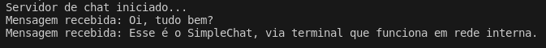

# SimpleChat

O SimpleChat permite a comunicação entre múltiplos dispositivos na mesma rede local. A aplicação é dividida em duas partes principais: o servidor de chat e o cliente de chat.
 
Por padrão o servidor utiliza a porta TCP/IP 12345, ja o chat da a permissão de escolher o endereço IP da maquina servidor, caso abra o chat na mesma maquina servidor não será necessario inserir o endereço IP pois por padrão é localhost.

## Funcionalidades

Funciona em diversos dispositivos que tenham java e que estejam na mesma rede.

## Instalação

Primeiramente é preciso compilar, para isso é necessario ter o Java instalado.

- cd src/
- javac client.ChatClient.java
- javac server.ChatServer.java

Para executar o servidor digite:

- java server.ChatServer

Para executar o chat digite:

- java client.ChatClient

## Pré-requisitos

Java
